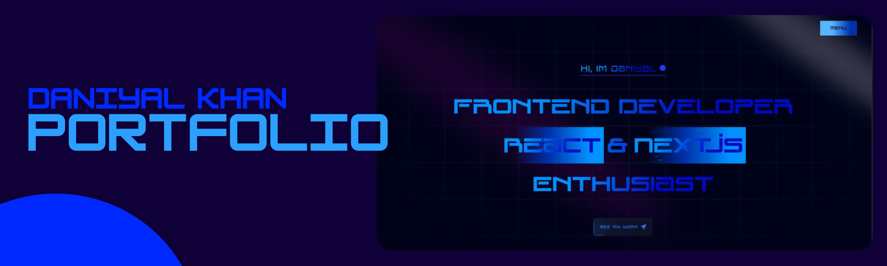

<div align="center">
  <br />
    <a href="http://daniyal-khan.vercel.app/" target="_blank">
      
    </a>
  <br />

  <div>
    
    
    
  

  </div>


<h3 align="center">Personal Portfolio</h3>
</div>

## 🚀 Live  
🔗 [View Project](https://daniyal-khan.vercel.app/)  

## <a name="introduction">🤖 Introduction</a>

A personal portfolio website built with Next.js 15, enhanced with Aceternity UI for a sleek and modern design. Showcasing projects, skills, and a contact form for seamless communication, all with a smooth and interactive user experience.

## ⚙️ Tech Stack

- ✔️ React 19
- ✔️ Next.js 15
- ✔️ TailwindCSS
- ✔️ TypeScript
- ✔️ Framer Motion


## ✨ Features  
- ✔️ **Hero**: Captivating intro with a spotlight effect, dynamic background, and smooth perspective text animation.  
- ✔️ **Bento Grid**: Modern layout presenting personal information using cutting-edge CSS design techniques.  
- ✔️ **Personal Projects**: Showcasing notable works to highlight skills and creativity.  
- ✔️ **Unveiling Effect**: A continuously moving, soft gradient background with a smooth reveal for an engaging visual experience.  
- ✔️ **Responsiveness**: Seamless adaptability across all devices, ensuring optimal viewing experience for every user.  

and many more, including code architecture and reusability  


Follow these steps to set up the project locally on your machine.

**Prerequisites**

Make sure you have the following installed on your machine:

- [Git](https://git-scm.com/)
- [Node.js](https://nodejs.org/en)
- [npm](https://www.npmjs.com/) (Node Package Manager)

**Cloning the Repository**

```bash
git clone https://github.com/Daniyalk0/Daniyal_Khan.git
cd Daniyal_khan
```

**Installation**

Install the project dependencies using npm:

```bash
npm install
```

**Running the project locally**

```bash
npm run dev
```